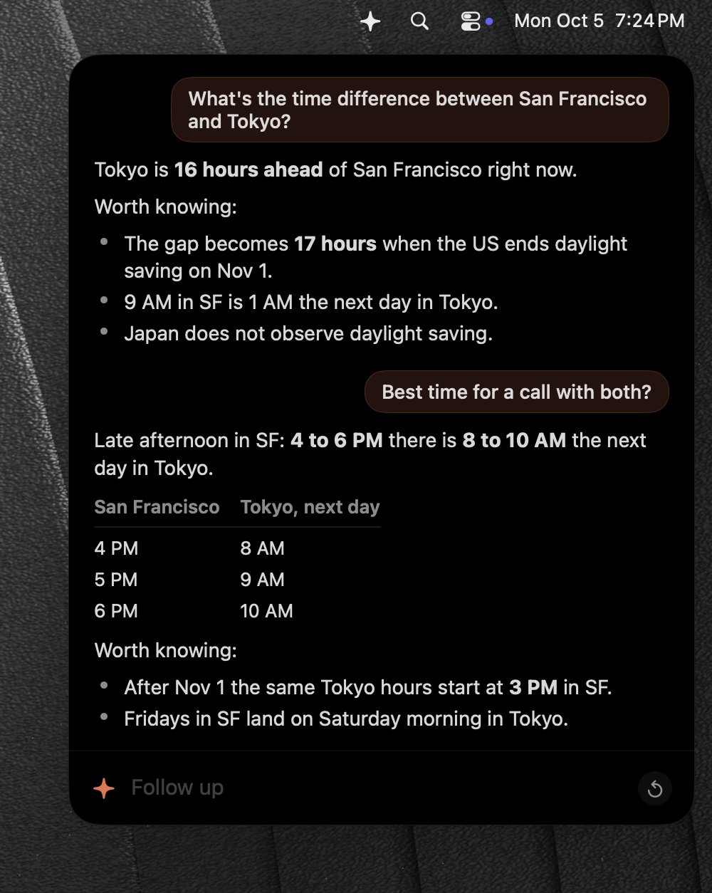
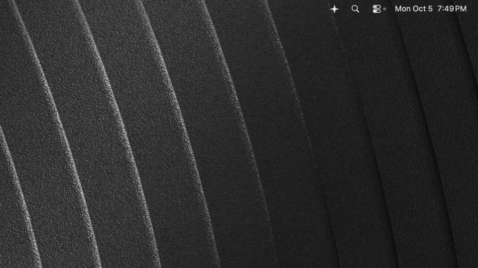

<p align="center"></p>

# Sidekick

Sidekick is a quick-answer panel for Claude that slides in and gets out of your way.

[](https://github.com/jonnilundy/sidekick/releases/latest)
[](#install)
[](LICENSE)

Press ⌥⌘Space, type a question, press Return. The answer comes first, in a line or three, then at most a few "worth knowing" bullets. Press Esc and you are back where you were. It is for the small questions that do not deserve a full session in a full app.

Sidekick runs your own `claude` command, so it has your whole setup: your CLAUDE.md, skills, connectors, hooks and login. No API key, no account, no server. Conversations are never saved to disk.

## Install

1. Download `Sidekick-<version>.zip` from the [latest release](https://github.com/jonnilundy/sidekick/releases/latest) and open it.
2. Drag Sidekick to Applications.
3. Right click Sidekick in Applications, choose Open, then click Open. macOS asks this once, because the app is not signed with an Apple developer certificate.
4. If macOS still refuses, open System Settings, go to Privacy & Security, and click Open Anyway next to Sidekick.

Sidekick needs [Claude Code](https://claude.com/claude-code) installed and logged in: `claude` must work in Terminal. On the first start Sidekick turns on Open at Login and opens once to show its shortcut. A ✦ appears in the menu bar.

### Build from source

```sh
git clone https://github.com/jonnilundy/sidekick.git
cd sidekick
scripts/install.sh
```

Needs macOS 15 and Swift 6 (Xcode or its Command Line Tools). The script builds a release, puts `Sidekick.app` in `/Applications` and starts it.

## Usage



| Do this | To |
| --- | --- |
| ⌥⌘Space, or click ✦ in the menu bar | Open or close the panel |
| Return | Ask |
| Esc, ⌘W, or click another app | Put it away |
| ⌘N, or the ↺ button | Reset: start a fresh session |
| ⌘. | Stop the answer |
| ⇧⌘C | Copy the last answer |
| ⌘, or right click ✦ | Settings |

- **One session all day.** Follow-ups know the earlier questions. It starts fresh at 5 AM, or whenever you press ⌘N.
- **Out of the way.** While an answer runs, the panel stays up. If you put it away, it comes back when the answer is done, without taking your keyboard. Esc gives the keyboard back to the app you were in.
- **Quiet when you come back.** After 3 minutes without activity, the panel opens as just the empty field. Hover the bottom edge of the card and drag down to pull the earlier questions back into view, or drag up to tuck them away.
- **Real markdown.** Lists, tables, code with colors, quotes, GitHub alerts, footnotes and math render properly while the answer streams.
- **Your login, never a key.** Sidekick removes `ANTHROPIC_API_KEY` and `ANTHROPIC_AUTH_TOKEN` before it starts `claude`, so answers always use your Claude Code login.

## Settings

- **Shortcut.** Default ⌥⌘Space.
- **Folder.** Where `claude` runs, so its project CLAUDE.md and files apply. Default: your home folder.
- **Model and effort.** Default: your Claude Code model at low effort, the fastest. The model names (Haiku, Sonnet, Opus, Fable) always run the newest model of each family; Settings shows which one gave the last answer.
- **Start fresh every day at 5 AM.** On by default.
- **Keep Claude ready.** One `claude` process waits in the background, so the first answer starts about 2 seconds sooner.
- **Open at login.**
- **Updates.** Your version, Check Now, and Check for updates automatically (on by default).

## How it works

- One `claude -p --input-format stream-json --output-format stream-json --no-session-persistence` process per session. Questions go in on stdin; text streams back.
- A spare process starts ahead of time, so asking skips Claude Code's startup.
- An app started at login gets a bare environment, so Sidekick reads your login shell's environment once (`$SHELL -lic env`) and passes it to `claude`. Hooks and MCP servers then find their tools and tokens.
- Sidekick adds a short prompt that asks for the answer first and no essays. It is in [`Sources/SidekickCore/ClaudeCommand.swift`](Sources/SidekickCore/ClaudeCommand.swift).

## Contributing

```sh
scripts/test.sh
```

The checks run in about 10 seconds and need no windows and no real `claude`: a stand-in (`scripts/fake-claude`) answers with the same stream format. Window tests, the demo and the update test run in a macOS VM. [AGENTS.md](AGENTS.md) lists every script and the test rules.

## License

MIT. See [LICENSE](LICENSE).
